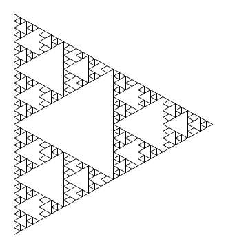
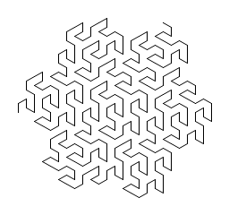
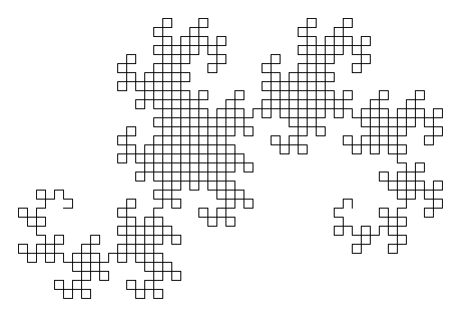

arustid
-------

A simple tool for drawing fractals based on [L-Systems] using [Turtle graphics]. Mostly built as an excercise in
Rust and [SDL2].

It operates in two modes. One renders the pattern to a window and the other renders to an image file.

## Examples

[Sierpinski triangle] with five iterations.

```
-a F-G-G -v 120 -r F:F-G+F+G-F -r G:GG -n 5 -o sierpinski.png
```



[Gosper curve] with three iterations.

```
$ arustid -a F -v 60 -r F:F-G--G+F++FF+G- -r G:+F-GG--G-F++F+G -n 3 -o gosper.png
```



[Dragon curve] with ten iterations.

```
$ arustid -a FX -v 90 -r X:X+YF+ -r Y:-FX-Y -n 10 -o dragon.png
```



[Turtle graphics]: https://en.wikipedia.org/wiki/Turtle_graphics
[L-Systems]: https://en.wikipedia.org/wiki/L-system
[SDL2]: https://github.com/AngryLawyer/rust-sdl2
[Sierpinski triangle]: https://en.wikipedia.org/wiki/Sierpinski_triangle
[Gosper curve]: https://en.wikipedia.org/wiki/Gosper_curve
[Dragon curve]: https://en.wikipedia.org/wiki/Dragon_curve
